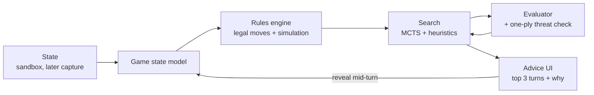

# Polytopia Move Advisor — Product Brief

Sep 24, 2026 · @Tyler MacPherson

## Summary

Polytopia Move Advisor recommends the strongest next action in a Battle of Polytopia game, with a short reason why. The MVP runs a simplified Polytopia inside its own engine against a scripted opponent, so the advisor reads state directly and the rules, search and explanations can be proven with zero data entry. Connecting to the real game (manual entry, then screenshots) follows once the advice is good, scoped to bot games and post-game review to avoid fair-play issues.

## Problem and opportunity

Polytopia looks simple, but each turn hides a large decision space: spend stars on tech, units or city growth, and move every unit in the right order. Most players learn optimal openings and economy timing from forum posts and videos, not from feedback on their own games.

- **No in-game coaching.** The game shows outcomes, not why a turn was weak or what the better line was.
- **Economy mistakes compound.** A wasted star or late key tech early on costs several turns later, and players rarely see the link.
- **Existing guides are static.** Tier lists and build orders ignore the actual map, tribe and opponent in front of you.

A tool that reads your real position and explains the best move turns every game into a lesson.

## Target users

The primary user is the builder; anything only other users would notice is polish that can wait.

| User | Need | How they use it |
| --- | --- | --- |
| Builder (primary) | A hands-on project in game AI and search, and better personal play | Owns the engine, rules model and evaluation loop; plays against the advisor daily |
| Improving player | Climb difficulty levels vs bots, learn openings | Live advice each turn in bot games, once real-game capture exists |
| Competitive player | Sharpen economy and tempo for multiplayer | Post-game review of saved turns, never live in ranked games |

## Goals and non-goals

**Goals**

1. (MVP) Model an explicit MVP rules subset exactly (see below), pinned to one recorded game version.
2. (MVP) The advisor sees only the player's view: revealed tiles and visible units. Full sandbox state is used only to evaluate results and, later, to score fog-reasoning guesses, so sandbox results stay honest and the advisor code is unchanged when it connects to the real game.
3. (MVP) Recommend a complete turn (tech, builds, unit moves, attack order) within 10 seconds per planning pass.
4. (MVP) Account for the enemy's reply: every plan passes a one-ply threat check against enemy units in range.
5. (MVP) Re-plan after any mid-turn reveal (new tiles, ruin reward, new tribe), and order exploratory moves first.
6. (MVP) Explain each recommendation in one or two sentences generated from the evaluator's components, e.g. "+2 stars per turn and the capital stays defended."
7. (v2) Make real-game tracking cheap enough that the builder keeps using it; this is the adoption risk, so it is a goal, not a footnote.

**MVP rules subset**

| In | Out |
| --- | --- |
| One tribe (Imperius) vs one bot, tiny map | Other tribes and tribe-specific units |
| Land units, deterministic combat, city capture | Naval units |
| Stars, tech tree, city growth and upgrade choices | Monuments |
| Ruins as a fixed, known reward | Random ruin rewards |
| Fog of war as a simple revealed/unrevealed mask | Diplomacy, embassies, alliances |

Polytopia combat is deterministic, so for the covered mechanics rules accuracy can realistically be near-perfect.

**Non-goals**

- Automating input or playing the game for the user.
- Live assistance in online multiplayer or ranked matches.
- Reading game memory, modifying the client, or anything that touches Midjiwan's servers.
- Full support for every tribe and game mode in v1.

## Core features

The MVP proves the engine inside a self-contained sandbox; connecting to the real game comes after the recommendations are trustworthy.

| Feature | Release | What it does |
| --- | --- | --- |
| Sandbox game | MVP | Play the MVP rules subset against a scripted bot in the advisor's own UI; state read directly |
| Rules engine | MVP | Legal-move generation and turn simulation for the MVP subset, from a versioned data file |
| Turn recommendation | MVP | Ranked top 3 full-turn plans with expected value, one-ply threat check and a short rationale |
| Mid-turn re-planning | MVP | Re-runs search after any reveal; exploratory moves recommended first |
| Manual state entry | v2 | Grid editor plus turn diffs to mirror a real bot game |
| Screenshot import | v2 | Computer vision parses a screenshot into board state for user confirmation |
| Fog-of-war reasoning | v2 | Estimates unseen enemy cities and units from what has been revealed |
| Deeper opponent search | v2 | Multi-ply search over likely enemy replies |
| Game review | v2 | Replays a finished game and flags the turns with the biggest value loss |
| All tribes and modes | v3 | Full tribe roster, naval, diplomacy, special units, Glory and Might modes |

## How it works

State flows from capture into a rules model, a search engine plays out candidate turns, and the UI shows the best plans.

- **Game state model.** Typed structs for tiles, cities, units, tech and stars, serializable to JSON so any turn can be saved and replayed.
- **Rules engine.** Encodes costs, movement, combat math and city growth. Coverage is tested against known in-game outcomes.
- **Search.** Monte Carlo Tree Search over full-turn action sequences, pruned by heuristics, because unit order and star spending create a huge branching factor.
- **Evaluator.** A hand-tuned score (stars per turn, city levels, army strength, tech, territory) first; a learned model trained on self-play later.
- **Hidden information.** MVP: the advisor sees only the player's view, with fog as a simple mask. v2: sample plausible versions of the fogged map and average results across them.
- **Stack.** Go for the rules engine and search (speed, concurrency); Python for screenshot parsing (v2); a simple web UI.

If this brief is shared beyond the builder, move the stack and search details into a tech design doc and keep a one-line summary here.

## Success metrics

The simulated metrics run hundreds of games overnight and are the main signal; human-play metrics confirm them later.

| Metric | Target | How measured |
| --- | --- | --- |
| Version regression | Each new evaluator or search version beats the previous one head-to-head | Sandbox matches between versions, fixed seeds; the day-to-day tuning signal |
| Advisor vs scripted bot | Advisor-driven player wins ≥ 80% of simulated games | Hundreds of sandbox games against the greedy scripted bot, run overnight |
| Rules accuracy (MVP) | 100% of scenario tests pass | Suite of set-up situations recorded on the pinned version (attacks, city level-ups, tech purchases); any mismatch is a bug |
| Rules accuracy (v2) | ≥ 98% of replayed turns match | Replay logged real-game turns, compare predicted vs actual state |
| Recommendation latency | ≤ 10 s per planning pass | Timed on a typical laptop |
| Win rate vs bots (v2) | +20 points over a fixed baseline | Baseline recorded before first use; with and without advice alternated game by game |
| State entry effort (v2) | ≤ 60 s per turn manual, ≤ 10 s with screenshots | Timed across a full game |

Playing with advice teaches the player, so the unassisted baseline drifts upward; fixing it up front and alternating conditions keeps the comparison honest.

## Risks and open questions

| Risk | Impact | Mitigation |
| --- | --- | --- |
| Real-game tracking is tedious | Builder stops using the tool mid-game | Sandbox MVP needs no entry; turn diffs and screenshots before any real-game rollout |
| Static evaluation misses enemy replies | Plans leave units or cities exposed | One-ply threat check in MVP; deeper opponent search in v2 |
| Plans go stale mid-turn | Advice ignores newly revealed tiles or ruins | Re-plan after every reveal; exploratory moves first |
| Rules drift after game patches | Wrong advice | Pin a game version; costs and stats in a versioned data file; scenario test suite on the pinned version |
| Branching factor too large | Slow or shallow search | Heuristic pruning, per-unit move grouping, time-boxed MCTS |
| Fair-play and ToS concerns | Reputation or account risk | Scope to bots and review; no client modification or automation |

**Open questions**

- Which platform is primary for v2 real-game tracking: desktop web, or a mobile companion alongside the game?
- Is a heuristic evaluator enough, or is self-play training worth it in v2? Tradeoff: component-based explanations work with a hand-tuned evaluator and get much harder with a learned model.
- Which exact game version to pin; record it when Phase 1 starts.

Decided: MVP is Imperius vs one bot on a tiny map.

## Milestones

Durations assume part-time, side-project pace; the fixed rules subset, not the estimates, is what keeps Phase 1 finite.

| Phase | Duration | Exit criteria |
| --- | --- | --- |
| 1. State model + rules engine | 5–8 weeks | MVP subset simulated; scenario test suite on the pinned version passes 100% |
| 2. Sandbox, scripted bot + thin advisor | 3–4 weeks | Full sandbox game playable; a trivial greedy one-step advisor runs the whole loop (player view → rules → search → rationale from evaluator deltas → re-plan) in the UI |
| 3. Search + evaluator | 4–6 weeks | Top-3 plans in ≤ 10 s with threat check and re-planning; each version beats the last; ≥ 80% wins vs the scripted bot |
| 4. Real-game tracking | 4–6 weeks | Manual entry with turn diffs, then screenshot import, for bot games |
| 5. Review mode + fog reasoning | 4 weeks | Flags the three costliest turns in a finished game |
