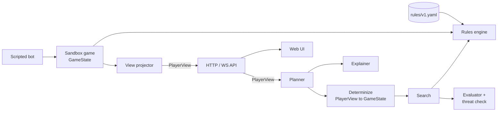
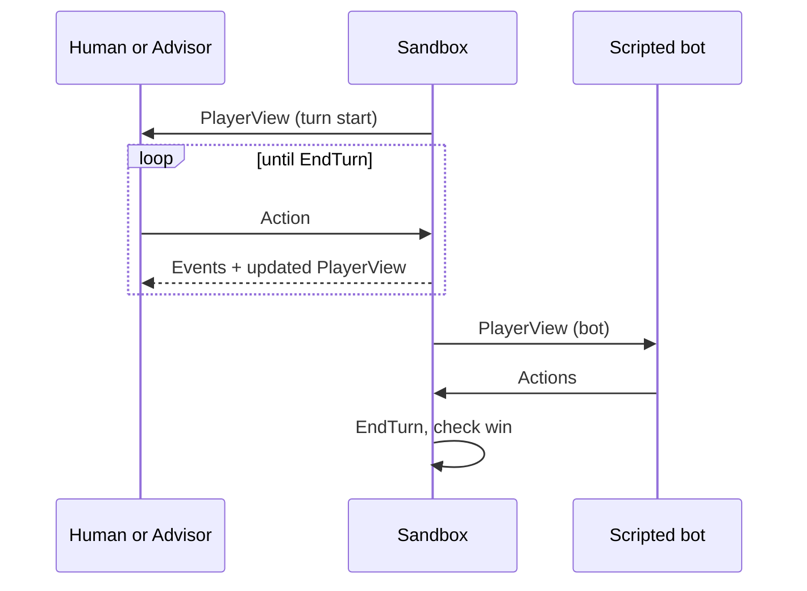

# Polytopia Move Advisor — Technical Design

Sep 24, 2026 · @Tyler MacPherson

## Overview and scope

This doc designs the MVP from the [product brief](https://claude.ai/code/artifact/dc05b571-933a-460c-b82f-be767201037a): a Go engine that simulates a Polytopia rules subset, a sandbox game against a scripted bot, and an advisor that recommends full turns with a one-ply threat check and plain-language rationale. v2 pieces are sketched only far enough to keep MVP interfaces stable.

**MVP subset:** Imperius vs one scripted bot that also plays Imperius, tiny map, land units only, deterministic combat, city capture, stars, tech, city growth and upgrade choices up to city level 4, ruins as a fixed reward, fog as a revealed/unrevealed mask. Out: naval (including ports and fish), monuments, diplomacy, random ruins, other tribes, city levels 5 and above with their rewards, and any reward with a random outcome (the Explorer).

**Design principles**

- **Data over code.** Unit stats and skills, costs, tech, level-up rewards and combat constants live in a versioned rules file pinned to one game build; the engine reads it.
- **One information boundary.** The advisor consumes a `PlayerView`, never the sandbox's `GameState`. Sandbox and real-game capture both produce a `PlayerView`, so the advisor never changes when the source does.
- **Determinism where it can be guaranteed.** Given a seed, every sandbox game is reproducible. Iteration-budgeted search runs (arena, tests, bug replays) are fully reproducible via a fixed iteration count, a fixed tree count and a per-tree seed. Interactive wall-clock runs are best-effort: how many iterations finish depends on the machine and scheduler.
- **Explainable by construction.** The evaluator is a sum of named components; explanations are built from their deltas.
- **Simple before clever.** A greedy advisor runs end to end before MCTS is built, and a beam planner is the baseline MCTS must beat.

## Architecture

A single Go binary hosts the rules engine, sandbox, bot and advisor, and serves a small web UI over HTTP and WebSocket. The API reaches the advisor only through the `Planner` interface, and everything the planner receives is a `PlayerView`.



The search simulates on a *determinized* `GameState` built from the `PlayerView` (unknown tiles filled with neutral defaults in MVP), never on the sandbox's true `GameState`.

**Repo layout**

```
polytopia-advisor/
  cmd/advisor/          main: loads rules, starts server
  cmd/arena/            headless batch runner for bot-vs-advisor and version-vs-version
  internal/rules/       rules file schema, loader, validation
  internal/state/       GameState, units, cities, actions, JSON codec
  internal/playerview/  PlayerView, ViewTile, SeenUnit, SeenCity, OpponentInfo (holds no GameState)
  internal/engine/      legal moves, apply action, end turn, combat
  internal/view/        GameState -> PlayerView projection
  internal/search/      Planner interface, determinization, greedy, beam and MCTS planners
  internal/eval/        evaluator components, threat check
  internal/explain/     rationale generation
  internal/sandbox/     game loop, map generator, scripted bot
  internal/api/         HTTP + WebSocket handlers
  rules/v1.yaml         pinned rules data
  testdata/scenarios/   scenario tests recorded from real games, plus community reference cases
  web/                  frontend (static, embedded via go:embed)
```

## Game state model

State is a flat, value-typed struct so it can be cloned cheaply thousands of times per search. Tiles live in a slice indexed by `y*W+x`; units and cities reference tiles by index, not pointer.

```go
type TileIdx int16
type PlayerID int8
type UnitID int32 // per owner, assigned from 1 by Player.NextUnitID; 0 means "no unit"

// UnitRef identifies a unit game-wide: two players can own units with the same UnitID.
type UnitRef struct {
    Owner PlayerID
    ID    UnitID
}

type GameState struct {
    RulesVersion string
    Turn         int
    Active       PlayerID
    W, H         int
    Tiles        []Tile
    Units        []Unit // dense; dead units removed at end of action, so refer to units by ID
    Cities       []City // never removed (capture changes Owner), so indexes are stable
    Players      []Player
    RNGSeed      uint64 // sandbox only; engine itself is deterministic
}

type Tile struct {
    Terrain  Terrain  // Field, Forest, Mountain, Water, Ocean
    Resource Resource // None, Fruit, Game, Crop, Fish (unused in MVP), Metal, Ruin
    Building Building // None, Farm, LumberHut, Mine, Port (unused in MVP)...
    Owner    PlayerID // -1 if unclaimed
    CityIdx  int16    // -1 if none
    Road     bool
    Explored uint8 // bitmask per player
}

type Unit struct {
    ID              UnitID // unique only together with Owner; see UnitRef
    Kind            UnitKind
    Owner           PlayerID
    Pos             TileIdx
    HP              int16 // stored x10 to keep combat in integers
    Kills           int8  // counts toward veterancy; threshold in rules file
    Vet             bool
    Moved, Attacked bool
    HomeCity        int16 // index into Cities; stable because cities are never removed
}

type City struct {
    Pos           TileIdx
    Owner         PlayerID
    Level         int8
    Population    int8
    Capital       bool
    Walls         bool // level-up reward
    Workshop      bool // level-up reward
    BorderRadius  int8 // grows with the border-growth reward
    PendingReward int8 // level whose reward is not yet chosen; 0 if none; at most one at a time
    UnitCount     int8
}

type Player struct {
    ID         PlayerID
    Tribe      Tribe
    Stars      int
    Techs      TechSet // bitset; must stay a value type (integer or fixed array), never a slice
    Alive      bool
    NextUnitID UnitID  // ID this player's next trained unit gets; starts at 1; see Unit IDs
}
```

- **Unit IDs** are per player. Each `Player` has its own `NextUnitID` counter, starting at 1, and training a unit takes the owner's next ID. A unit is identified by its `UnitRef` (owner and ID), never by ID alone, since both players have a unit 1. A single global counter would leak hidden information: the gaps in a player's own unit IDs would show how many units the enemy trained in between. The counter lives in `GameState`, so `Clone` copies it with the rest of the player.
- **Actions** are a tagged struct (`Move`, `Attack`, `Train`, `Research`, `Harvest`, `Build`, `CaptureCity`, `CityUpgrade`, `EndTurn`) with fixed fields, so they hash and serialize cleanly. Actions reference units by `UnitRef` or by tile, never by slice index, because dead units are removed from `Units` mid-plan and indexes shift. Search-only moves (`AdvancePhase`, `ReturnToPhase`, `DeferUnit`, see Search) never reach the engine.
- **Cloning** copies the struct and then each slice with `make` + `copy`. A struct copy alone shares the slices' backing arrays, so a clone would mutate its parent. No maps or pointers in `GameState` keeps it allocation-light. If profiling in Phase 3 shows clone cost dominating search, switch to apply/undo or pooled buffers.

```go
func cloneSlice[T any](src []T) []T {
    dst := make([]T, len(src))
    copy(dst, src)
    return dst
}

func (s *GameState) Clone() *GameState {
    c := *s // copies scalars; slice headers still alias s until replaced below
    c.Tiles = cloneSlice(s.Tiles)
    c.Units = cloneSlice(s.Units)
    c.Cities = cloneSlice(s.Cities)
    c.Players = cloneSlice(s.Players)
    return &c
}
```

- **Serialization** is JSON with a schema version; every turn of every sandbox game is saved, which feeds replays, bug reports and v2 review mode.
- **Hashing** uses Zobrist keys over tiles, units and player resources, for transposition detection in search.

## Rules data and engine

All balance numbers live in `rules/v1.yaml`, loaded and validated at startup; the engine contains mechanics only. A game patch means a new rules file plus re-recorded scenario tests, not code changes.

```yaml
version: v1
game_build: "<record at Phase 1 start; see Pinning the game build>"
units:
  # stats and skills illustrative until verified against the pinned build
  warrior: { cost: 2, hp: 10, attack: 2, defense: 2, move: 1, range: 1, tech: null, skills: [dash, fortify] }
  archer:  { cost: 3, hp: 10, attack: 2, defense: 1, move: 1, range: 2, tech: archery, skills: [dash, fortify] }
  # skill vocabulary for MVP: dash, escape, fortify, persist (semantics verify on pinned build)
techs:
  organization: { tier: 1, requires: null, unlocks: [harvest_fruit] }
  # ...
veterancy:
  kills_required: 3  # verify on pinned build
city:
  level_up_rewards:  # options per level: verify on pinned build
    2: [workshop, explorer]
    3: [city_wall, resources]
    4: [population_growth, border_growth]
  mvp_excluded_rewards: [explorer]  # moves randomly; chance nodes are a v2 option
  max_city_level: 4  # MVP cap; level 5+ rewards (park, super unit: verify on pinned build) are out of scope
unused_in_mvp:  # naval is out of scope
  buildings: [port]
  resources: [fish]
combat:
  formula: community_v1
  # integer x10 constants so combat stays in integer HP x10; all values verify on pinned build
  damage_scale_x10: 45
  defense_bonus_x10: 15
  wall_bonus_x10: 40
```

**Pinning the game build.** The build number must be read from the game, so it stays a placeholder until Phase 1 starts. Procedure:

1. On the device used for recording, read the game's version string (the exact screen that shows it: verify on pinned build) and note the platform, since builds may differ between Steam, iOS and Android.
2. Write platform and version into `game_build` in `rules/v1.yaml`, exactly as displayed (for example `"<platform> <version>"`).
3. Copy that string into the `build` field of every scenario file recorded on that build.
4. The scenario test runner compares each file's `build` to the loaded rules file's `game_build` and fails the suite on any mismatch, so scenarios from a different build are rejected, never silently run.
5. Disable auto-update on the recording device where the platform allows it. If the game updates anyway, stop recording scenarios until a new rules file exists for the new build.

**Engine API** (pure functions over state, no I/O):

```go
func LegalActions(s *GameState, r *Rules) []Action
func Apply(s *GameState, r *Rules, a Action) (Events, error)
func EndTurn(s *GameState, r *Rules) Events

// ResolveCombat returns the damage each unit receives, in HP x10.
// dmgToDefender is applied first; dmgToAttacker is the retaliation and is 0 when
// the defender dies or cannot retaliate (retaliation rules: verify on pinned build).
func ResolveCombat(att, def Unit, defTile Tile, r *Rules) (dmgToAttacker, dmgToDefender int16)
```

- **Events** (`TileRevealed`, `UnitKilled`, `CityCaptured`, `CityLeveled`, `RuinOpened`) come back from every `Apply`. The advisor uses reveal events to trigger re-planning; the UI uses them for animation and logs.
- **Combat** uses the community-documented Polytopia formula (damage scales with attack vs defense force, adjusted by remaining HP and defense bonuses), in integer HP x10 to avoid float drift. Its constants (damage scaling, defense bonus, wall bonus) live under `combat` in the rules file, so a mismatch is fixed in data, not code. They are the most likely source of mismatches, so they get the densest scenario coverage: first set from the community tables, then checked against observed cases.
- **City leveling** applies one level at a time. When population crosses a level threshold, the engine sets `PendingReward` and emits `CityLeveled`; while a reward is pending, `LegalActions` returns only that reward's `CityUpgrade` options (whether the game forces an immediate choice: verify on pinned build). Choosing the reward re-checks the threshold, so a population gain that spans two levels produces a second `CityLeveled` instead of two pending rewards. Cities stop at `max_city_level` (4 in MVP): further growth still adds to `Population` but never triggers a level, so the engine never reaches an undefined reward.
- **Movement** is a BFS over tiles with terrain costs and zone-of-control stops; results are cached per unit per state hash. Unit skills from the rules file (dash, escape, fortify, persist) decide which actions stay legal after a move, an attack or a kill; exact semantics verify on pinned build.
- **Validation**: `Apply` rejects illegal actions with a typed error. A debug build re-checks every state invariant (star totals, unit counts per city, tile ownership) after each action.

## Information boundary

The advisor never receives the sandbox's `GameState`. The API passes the `Planner` a `PlayerView` produced by `view.Project(state, player)`, and `Planner` is the API's only entry point into the advisor. `PlayerView` lives in its own package, `internal/playerview`, and holds no `GameState`, no unobservable fields of enemy units or cities, and no index into a true slice. This keeps sandbox win rates honest and makes real-game capture a drop-in replacement.

```go
type PlayerView struct {
    RulesVersion string
    Turn         int
    Me           state.PlayerID
    W, H         int
    Tiles        []ViewTile     // Known=false for unexplored tiles; no city index, cities are found by Pos
    MyUnits      []state.Unit   // HomeCity remapped to an index into MyCities, -1 if not mine
    SeenUnits    []SeenUnit     // enemy units on any explored tile (no re-fog; verify on pinned build)
    MyCities     []state.City   // full state of my own cities
    SeenCities   []SeenCity     // other cities and villages on explored tiles
    MyPlayer     state.Player   // full stars and techs
    Opponents    []OpponentInfo // tribe and what is observable, not stars
}

// SeenUnit holds only what the player can observe of an enemy unit
// (field list: verify on pinned build).
type SeenUnit struct {
    ViewID state.UnitID // assigned per view in tile order; unrelated to the true ID
    Kind   state.UnitKind
    Owner  state.PlayerID
    Pos    state.TileIdx
    HP     int16
    Vet    bool
}

// SeenCity holds only what the player can observe of a city they don't own
// (field list: verify on pinned build).
type SeenCity struct {
    Pos     state.TileIdx
    Owner   state.PlayerID // -1 for an unclaimed village
    Level   int8
    Capital bool
    Walls   bool
}
```

| Data | Advisor sees | Used only by harness |
| --- | --- | --- |
| Explored tiles, terrain, resources | Yes | — |
| Unexplored tiles | Unknown flag only | Full contents |
| Enemy units | Kind, owner, position, HP and veteran status on any explored tile (no re-fog; verify on pinned build) | Units on unexplored tiles; true IDs, kills, home cities, move flags |
| Other cities | Position, owner, level, capital and walls on explored tiles (verify on pinned build) | Cities on unexplored tiles; population, workshop, borders, unit count |
| Enemy stars and techs | No (inferred later in v2) | Exact values |
| Own state | Everything | — |

The view projector follows two rules. An enemy unit is copied into `SeenUnits` if it stands on a tile the player has explored, whether or not that tile is in current sight range. And every cross-reference into a true slice is remapped or stripped: seen units get view-local IDs assigned in tile order, own units' `HomeCity` is remapped into `MyCities`, and tiles carry no city index. An index into a filtered slice means something different from an index into the true one, a true city index can reveal a city the player hasn't discovered, and sequential unit IDs reveal how many units the enemy has trained.

- **Determinization for search (MVP):** `search.Determinize` turns a `PlayerView` into a `GameState`. `MyCities` come first in `Cities`, so own units' `HomeCity` indexes stay valid, followed by `SeenCities` with unobservable fields at neutral defaults. Seen enemy units keep their `Owner` and take their `ViewID` as ID. Their IDs cannot collide with own units because units are identified by owner and ID. Each opponent's `NextUnitID` is set one past its highest assigned ID, so units the enemy trains during search get fresh IDs. Seen enemy units get `Kills` 0, `HomeCity` -1 and move flags cleared. Unknown tiles become neutral fields with no resources or units. Crude, but safe and unbiased by hidden truth, and the same view always determinizes to the same state.
- **Enforcement, primary: mutation test.** The test plans on a view with an iteration budget and fixed seed (so the output is deterministic, see Search), then mutates hidden parts of the *live* sandbox state in place: unexplored tiles, units on them, enemy stars and techs, and the unobservable fields of visible units and cities (true IDs, kill counts, home cities, move flags, city population and buildings). It re-plans and asserts the recommendation is unchanged. Mutating the live state, not a copy, means any side channel from the planner into the sandbox shows up as a changed plan.
- **Enforcement, secondary: import test.** A `go list -deps` test asserts `internal/search`, `internal/eval` and `internal/explain` have no import path to `internal/sandbox`, `internal/view` or `internal/api`, and that `internal/api` imports no advisor package other than `internal/search`. This is weaker than it looks: the advisor legitimately imports `internal/state` to build determinized states, so the `GameState` type is available to it. The import test proves where a true `GameState` cannot come from, not that every `GameState` the advisor touches was built from a view; the mutation test covers that.

## Search

A Polytopia turn is a sequence of many actions, so the planner searches over *turn plans*, not single moves. Three planners share one interface: a greedy planner for Phase 2, then a beam planner and MCTS for Phase 3. The budget can cap iterations, wall-clock time, or both.

```go
type Budget struct {
    Iterations int           // MCTS rollouts or beam expansions per planning pass; 0 = no cap
    Time       time.Duration // wall-clock cap; 0 = none (interactive use only)
    Trees      int           // root-parallel trees; fixed for reproducible runs, 0 = runtime.NumCPU()
    Seed       uint64        // tree i uses a seed derived from (Seed, i)
}

type Planner interface {
    // Plan returns the top 3 plans. It stops at whichever cap in b is reached first;
    // at least one of b.Iterations and b.Time must be non-zero.
    Plan(ctx context.Context, v playerview.PlayerView, r *rules.Rules, b Budget) []TurnPlan
}

type TurnPlan struct {
    Actions   []state.Action
    Value     float64        // evaluator score after plan + threat penalty
    Delta     eval.Breakdown // per-component change vs start of turn
    Threats   []eval.Threat
    Rationale string         // from the explainer, so the API needs nothing beyond Planner
}
```

**Greedy planner (Phase 2).** Repeatedly apply the single legal action with the best one-step evaluator delta until no action improves the score, then end turn. Cheap to build, exercises the full loop, and becomes the regression floor. It ignores the budget. It also runs the same clone, apply, evaluate and threat-check calls as a rollout's final scoring, so it is where their cost is first measured, at the end of Phase 2.

**Macro phases and unit order** (shared by the beam and MCTS planners)

1. **Macro phases.** A turn is split into ordered phases: captures, exploration, research, combat and moves, economy and training. Captures come first because the capturing unit must start its turn in the city, so nothing later in the turn can create a new capture. Each tree level picks one action within the current phase, `AdvancePhase`, or `ReturnToPhase`. This cuts branching sharply.
2. **Return to an earlier phase.** `ReturnToPhase` reopens exploration, research, or combat and moves after a later phase has run, so search can find lines that cross the fixed order. For example: a harvest levels up a city, its reward grants stars, and the plan returns to research to spend them. It is limited to one return per turn (starting value, tuned in the arena), and captures cannot be reopened.
3. **Unit ordering.** Within a phase, units are queued by a fixed priority: in exploration, units whose moves can reveal tiles; in combat and moves, attackers by threat, then defenders. Each tree node chooses an action for the unit at the head of the queue, or `DeferUnit`, which moves that unit to the back of the queue. Each unit can be deferred at most once per phase (starting value). This keeps order permutations from being re-searched wholesale while still finding combinations such as one unit softening a target and another finishing it.
4. **Pruning.** Discard dominated actions: moves that end on a threatened tile with no gain, purchases the player can't afford after mandatory spending, attacks with expected loss above a threshold.

**Beam planner (Phase 3, baseline).** Expands partial plans through the same phases and search-only moves, keeping the K best by evaluator minus threat penalty at each depth (starting K = 16). One expansion counts as one iteration against `Budget.Iterations`. It is cheap to build and gives MCTS a baseline to beat in the arena before any time goes into UCT tuning.

**MCTS planner (Phase 3)**

1. **Tree moves.** Phases, `ReturnToPhase` and `DeferUnit` as above.
2. **Rollouts.** Complete the rest of the turn with a cheap rollout policy, then score the final state once with the full evaluator minus threat penalty. The greedy policy is too expensive for rollouts: at every step it clones, applies and fully evaluates every legal action, including the threat check's BFS and scratch combat, so one greedy rollout can mean hundreds or thousands of evaluator calls. The rollout policy instead picks each action from cheap per-action rules (take a kill or capture if one is available, harvest or build what is affordable, otherwise a random legal move), drawing randomness from the tree's seeded RNG, and never calls the evaluator or threat check before the final state. The randomness also makes root-parallel trees diverge. No multi-turn rollouts in MVP.
3. **Selection.** UCT with a tuned exploration constant; transpositions merged by Zobrist hash within a tree.
4. **Budget, interactive.** `Time` 8 s with a hard stop at 10 s, `Iterations` 0, `Trees` = all cores (root parallelization: independent trees, merged visit counts). Best-effort reproducibility only.
5. **Budget, arena, tests and bug replays.** `Iterations` 256 per planning pass, `Time` 0, `Trees` 1, fixed `Seed`; the arena parallelizes across games instead of within one. 256 is a starting value. The target is about 1 ms per rollout with the cheap policy (a few dozen cheap steps plus one full evaluation), or about 0.25 s per pass, which keeps one arena game to seconds rather than minutes. Evaluation cost is measured at the end of Phase 2 and rollout cost as soon as the rollout policy exists; if either misses the target, cut iterations or the seed set rather than accept a multi-hour nightly run. With a fixed iteration count, tree count and per-tree seed, a run is fully reproducible; when `Trees` > 1, iterations are split evenly across trees and visit counts are merged in tree order.
6. **Output.** The three most-visited distinct plans, deduplicated by final state hash.

**Re-planning.** The advisor executes a plan action by action in the UI. When `Apply` emits `TileRevealed` or `RuinOpened`, the remaining plan is discarded and search restarts from the new view. Interactive runs use the remaining time budget, floored at 3 s; iteration-budgeted runs get the full iteration budget for each planning pass. Exploration is the second phase, right after captures, so most reveals happen before research, combat and economy are committed. Reveals from moves in the combat and moves phase still trigger a re-plan.

## Evaluator and threat check

The evaluator scores a determinized `GameState` as a weighted sum of named components; weights live in a config file and are tuned by the arena. The threat check subtracts the expected cost of the enemy's best immediate reply.

```go
// Evaluate scores s from me's perspective. It is only ever called on states built
// by search.Determinize from a PlayerView, which contain nothing the view didn't,
// so it cannot leak hidden information by construction.
func (e *Evaluator) Evaluate(s *state.GameState, me state.PlayerID) Breakdown
```

The type alone can't prove a `GameState` was determinized, since the true state has the same type; the mutation test in Information boundary checks that the rule holds.

| Component | Measures | Why it matters |
| --- | --- | --- |
| Income | Stars per turn after this plan | Economy compounds every turn |
| Banked stars | Unspent stars, with diminishing value | Penalizes hoarding without forbidding saving |
| City development | Sum of city levels and populations | Future income and unit capacity |
| Army strength | Unit cost × HP fraction, own minus seen enemy | Ability to attack and defend |
| Territory | Owned tiles and reachable resource tiles | Room to grow |
| Tech value | Weighted unlocked techs relevant to owned resources | Options for future turns |
| Exploration | Explored tile count, with bonus for revealed cities and ruins | Information and expansion targets |
| Capital safety | Defenders adjacent to capital vs enemy force in range | Losing the capital is decisive |

```latex
V(s) = \sum_i w_i \cdot c_i(s) \; - \; \lambda \cdot T(s)
```

**Threat check T(s).** Threats are aggregated per attacker, so each enemy unit attacks at most once and focus fire is counted.

1. For every seen enemy unit, compute the tiles it can attack next turn (move then attack, respecting zone of control) and the own units and cities in reach.
2. Greedily assign attackers: repeatedly pick the (attacker, target) pair with the largest marginal expected loss given damage already assigned to that target, simulate the attack with `ResolveCombat` on a scratch copy, and remove that attacker. Attacks on the same target are applied in sequence, so damage stacks and a kill by the second attacker is counted. Ties break by `UnitRef` (owner, then ID). Stop when no pair has positive marginal loss.
3. A city capture threat counts whenever an enemy unit can reach the city tile next turn; the capture itself would happen on the enemy's following turn. The threat is discounted (factor in the weights config, starting value 0.5) if any own unit could kill the intruder with a single `ResolveCombat` call from that unit's current reach. This keeps the check one-ply: deciding whether the player's whole next turn could kill the intruder would put a second ply inside every leaf evaluation. Moving onto the city is one of the assignment options for an attacker, valued at the city's worth, so a unit can't both attack elsewhere and threaten the city.
4. T(s) is the sum of the assigned expected losses. Each non-zero assignment is kept as a `Threat` for the explainer.

```go
type Threat struct {
    Attacker     state.UnitRef
    Target       state.UnitRef // zero UnitRef when the target is a city
    City         int16         // index into Cities; -1 for unit targets
    ExpectedLoss float64
    Capture      bool
}
```

- Unseen enemy units are ignored in MVP. v2 adds sampled hidden units from fog reasoning.
- λ starts at 1.0 and is tuned in the arena alongside the component weights.

## Explanation generation

Each plan's rationale is built from its evaluator breakdown and threat list, using templates. No language model is involved in MVP, so explanations are fast, deterministic and always true to the score.

1. Compute `Delta = Breakdown(after) − Breakdown(before)` per component, weighted.
2. Rank components by absolute weighted delta; keep the top two positives and the top negative if it exceeds a threshold.
3. Add the largest remaining threat, or state that none remain if the plan cleared one.
4. Render each item with a template, joined into at most two sentences.

| Component | Template |
| --- | --- |
| Income | "+{n} stars per turn from {source}" |
| Capital safety | "keeps the capital defended against {attacker}" |
| Exploration | "reveals {n} tiles toward {target}" |
| Threat remaining | "leaves {unit} exposed to {attacker} (−{loss})" |

Example: *"+2 stars per turn from the new farm and keeps the capital defended against the enemy archer. Leaves the forward warrior exposed (−1.5)."*

Comparisons between the top 3 plans use the same deltas: "Plan 2 trades 1 star per turn for a stronger defense." A learned evaluator in v2 would break this approach, which is the main cost of that option.

## Sandbox and scripted bot

The sandbox owns the true `GameState`, runs the turn loop, and is the only package that holds hidden information.



- **Map generator.** Seeded, tiny map, two capitals at a fixed minimum distance, terrain and resource densities drawn from the rules file, a fixed number of ruins and villages. Same seed produces the same map.
- **Scripted bot = greedy baseline.** Plays Imperius, like the advisor: the rules subset covers no other tribe, and identical tribes make mirrored seeds fully symmetric. Uses the same greedy planner and evaluator with its own fixed weights, plus simple scripts: always defend a threatened capital, attack when expected damage is favorable, expand to the nearest village. It sees only its own `PlayerView`, same rules as the advisor, including the MVP reward exclusions.
- **Difficulty knobs.** Starting stars bonus and aggression weight, so the bot can be strengthened once the advisor clears 80%.
- **Win condition.** Domination (other capital captured and no cities left). A game that reaches the turn limit of 30 (starting value) is a draw, reported separately; there is no score tiebreaker, so the advisor's own evaluator never decides a result.
- **Modes.** Interactive (human plays, advisor suggests, wall-clock budget) and headless (advisor plays with an iteration budget, used by the arena).

## UI and API

The UI is a static page embedded in the Go binary: a canvas grid for the map, a side panel for the top 3 plans with rationale, and step-through controls. It talks to the engine over a small REST API plus one WebSocket for events.

| Endpoint | Method | Purpose |
| --- | --- | --- |
| /api/games | POST | New sandbox game from seed and settings; returns game ID |
| /api/games/{id}/view | GET | Current PlayerView for the human |
| /api/games/{id}/actions | POST | Apply one action; returns events and new view |
| /api/games/{id}/advice | POST | Run the Planner with a budget (wall clock, or iterations and seed to replay); returns top 3 TurnPlans with rationale |
| /api/games/{id}/replay | GET | Saved per-turn states for review and bug reports |
| /ws/games/{id} | WS | Streams events, search progress and re-plan notices |

- **Plan display.** Arrows for moves and attacks, icons for purchases, the rationale sentence, and a threat overlay on exposed tiles.
- **Follow mode.** "Play next step" applies the next action of the selected plan; a reveal triggers a re-plan notice over the WebSocket and refreshes the panel.
- **Frontend stack.** Plain TypeScript with canvas rendering, bundled at build time and embedded with `go:embed`, so the whole tool ships as one binary.

## Testing and evaluation harness

Three layers: scenario tests prove the rules, unit and property tests guard the engine, and the arena measures playing strength. Scenario and engine tests run in CI; the arena runs nightly, which the iteration budget makes feasible.

**Scenario tests.** Polytopia has no scenario or map editor that we know of (verify on pinned build), so positions can't be staged on demand. Scenarios are recorded opportunistically from real games on the pinned build: when a covered event happens (an attack, a kill, a capture, a level-up, a tech purchase, a harvest), take a screenshot before and after, then transcribe the relevant tiles, units, HP and city state to YAML. Every scenario records its source:

- **community**: cases computed from the community-documented combat formula and damage tables. They give dense combat coverage from day one and are how the combat constants in `rules/v1.yaml` are first set.
- **observed**: cases transcribed from screenshots. Fewer, growing with play time, and authoritative: if an observed case contradicts a community case, the observed case wins and the rules file or the community case is corrected.

The target is 100% passing, since combat is deterministic and any mismatch is a bug. The test report gives pass counts separately by source: community cases come from the same formula the engine implements, so they verify the implementation, not the game, and only observed cases are evidence that the rules match the game. The runner rejects any file whose `build` differs from the rules file's `game_build`.

```yaml
name: archer_attacks_warrior_on_forest
build: "<pinned build>"  # must equal game_build in rules/v1.yaml
source: observed         # observed | community
evidence: [shots/0042_before.png, shots/0042_after.png]
setup:
  tiles: [{ at: [3,4], terrain: forest }]
  units:
    - { kind: archer,  owner: 0, at: [3,2], hp: 10 }
    - { kind: warrior, owner: 1, at: [3,4], hp: 10 }
action: { attack: { from: [3,2], to: [3,4] } }
expect:
  units:
    - { at: [3,4], hp: <observed> }
    - { at: [3,2], hp: <observed> }
```

Coverage targets for Phase 1, recognizing that observed coverage grows unevenly with play time (attacks are common, captures and higher level-ups are rare):

- **Combat:** every community case for the MVP unit pairs on each terrain and defense condition passes, plus a starting target of 10 observed combat cases that include at least one retaliation and one kill.
- **Other mechanics:** at least one observed case for each of city capture, each MVP level-up reward, tech purchase at two or more city counts, and harvesting and building on each MVP resource. Categories still without an observed case at the end of Phase 1 are listed as coverage gaps in the test report, not as failures, and are filled as games are played.
- **Pass rate:** 100% of recorded scenarios pass, reported separately for community and observed cases.

**Engine tests.** Table-driven unit tests per rule; property tests (random legal action sequences) assert invariants never break and that `Apply` then JSON round-trip gives the same state hash.

**Arena** (`cmd/arena`). Arena runs use iteration budgets only, so every game is reproducible and one game takes seconds. Wall-clock budgets appear only in the latency run.

| Run | Games | Budget | Pass condition |
| --- | --- | --- | --- |
| Version regression | 400 per pair (200 seeds, mirrored) | 256 iterations per pass, 1 tree | New version wins > 55% of decisive games (one-sided binomial p < 0.05); draw rate reported |
| Advisor vs scripted bot | 500 (250 seeds, advisor on each side) | 256 iterations per pass, 1 tree | ≥ 80% wins over all games (draws count as non-wins); draw rate reported |
| Latency | 200 random mid-game views | 8 s wall clock, 10 s hard stop, all cores | p95 ≤ 10 s per planning pass; iterations per second logged to recalibrate the arena budget |
| Information boundary | 100 views with mutated hidden state | 256 iterations, fixed seed | Identical recommendations |

Mirrored seeds play each map twice with sides swapped to cancel map bias. Turn-limit draws are excluded from the version-regression win-rate denominator, since they carry no information about which version is stronger, and the draw rate is reported next to the result. Watch that rate: greedy play on a tiny map can stall, and if many games reach turn 30 the regression test runs on far fewer than 400 decisive games and may rarely reach significance. Raising the turn limit is the lever. Results write to a JSON log per run for trend tracking.

**Arena cost.** At the default budget and the target of ~1 ms per rollout, an advisor planning pass costs about 0.25 s. With roughly 45 passes per advisor side per game, a version-vs-version game is about 25 s of one core, and an advisor-vs-bot game about 12 s plus the bot's turns. The bot runs the full-evaluation greedy loop, so its cost is not negligible; it is measured at the end of Phase 2 along with evaluation cost. At target, the nightly set (about 900 games) takes roughly 30–40 minutes on 8 cores. Cost scales linearly with rollout cost, so at 10 ms per rollout the same set takes 5–6 hours, which is why the cheap rollout policy matters. The provisional seed set is 250 map seeds, which fits the window at target and matches the game counts above; it is re-sized once costs are measured.

## v2 extensions

Each v2 feature plugs into an MVP interface without changing the advisor: capture produces a `PlayerView`, fog reasoning replaces determinization, and review reuses saved turns.

- **Manual entry.** A grid editor in the web UI writes a `PlayerView` directly. Turn diffs pre-fill from the last turn plus the advisor's own plan; the user corrects only what differs (enemy moves, reveals, bot captures).
- **Screenshot import.** A CV service (grid detection, a small classifier for tiles, units and HP digits) returns a candidate `PlayerView` as JSON; the UI shows it for confirmation before the engine accepts it. Whether this is a Python sidecar or Go-only is deferred (see Open questions).
- **Fog reasoning.** Replace the neutral-fill determinization with sampling: generate N plausible hidden states (enemy cities at likely distances, units consistent with last sightings and estimated stars), plan on each, and aggregate plan values. Scored in the arena against the sandbox's true state.
- **Chance nodes.** Model random outcomes, such as the Explorer level-up reward and random ruin rewards, as chance nodes in search, lifting the MVP exclusions.
- **Deeper opponent search.** Replace the one-ply threat check with a short enemy-turn search using the scripted bot's policy.
- **Review mode.** Replay a saved game; for each turn, run the planner on the start-of-turn view and report value lost vs the move actually played. Flag the three costliest turns with the explainer's deltas.
- **Rules accuracy (v2).** Once real games are logged, replay each logged turn through the engine and compare to the recorded next state, targeting ≥ 98%.

## Open questions and decisions

| Decision | Choice | Rationale |
| --- | --- | --- |
| Engine language | Go | Fast cloning and simulation, easy parallel search, single-binary delivery |
| Evaluator | Hand-tuned weighted sum | Keeps explanations exact; learned model deferred |
| Evaluator input | `Evaluate(*GameState, me)`, called only on determinized states | Search simulates on determinized states, which hold nothing beyond the view |
| MVP determinization | Neutral fill of unknown tiles | Simple and cannot leak hidden state |
| Information boundary | `PlayerView` in its own package; `Planner` is the API's only entry point; mutation test primary, import test secondary | The advisor needs `internal/state`, so imports alone can't prove the boundary |
| Enemy data in `PlayerView` | Observable-only `SeenUnit` and `SeenCity` types; view-local IDs; all cross-references remapped or stripped | `state.Unit` fields and true indexes leak unit counts and undiscovered cities, and the mutation test didn't cover them |
| Search unit | Full turn plans via phased search; beam baseline, then MCTS | Matches how Polytopia turns are played; controls branching; beam shows whether MCTS earns its cost |
| Search budget model | `Budget` with iteration and wall-clock caps; arena, tests and replays use 256 iterations per pass (starting value) with 1 tree; interactive uses 8 s with a 10 s hard stop | Wall-clock arena runs would take 80+ hours per night; 256 iterations keeps a game to seconds at the ~1 ms per rollout target |
| Rollout policy | Cheap rule-based policy with seeded randomness; full evaluation only on the rollout's final state | Greedy rollouts cost hundreds or thousands of evaluator calls each, which would put the nightly arena back at many hours |
| Determinism | Iteration-budgeted runs fully reproducible (fixed count, tree count, per-tree seed); wall-clock runs best-effort | Wall-clock budgets and root parallelization can't be reproduced exactly |
| Macro phase order | Captures, exploration, research, combat and moves, economy and training; one `ReturnToPhase` per turn | The capturing unit must start its turn in the city; early exploration limits re-plans; the return finds cross-phase lines |
| Unit ordering | Fixed priority plus `DeferUnit`, once per unit per phase | Finds soften-then-finish combinations without searching every permutation |
| Threat aggregation | Per attacker, greedy assignment, damage stacked per target | Each enemy unit attacks once, and focus fire is counted |
| City capture threat | Counted when an enemy can reach the city; discounted if one own unit could kill the intruder in a single attack | Keeps the check one-ply inside every leaf evaluation |
| Turn-limit result | Draw, reported separately, excluded from the regression win-rate denominator | The advisor's own evaluator must not decide results |
| City level cap | 4 in MVP | Level 5+ rewards (possibly a new unit type) are outside the subset; the cap keeps the engine out of undefined states |
| Pending level-up rewards | One at a time; the next level applies after the reward is chosen | A population gain spanning two levels stays representable with a single field |
| Bot tribe | Imperius | The rules subset covers only Imperius, and mirrored seeds become fully symmetric |
| Turn limit | 30, starting value | Raise it if draws leave too few decisive games for the regression test |
| Explorer reward | Excluded in MVP | Random movement breaks the deterministic subset; chance nodes in v2 |
| Combat constants | In `rules/v1.yaml` | Data over code; mismatches fixed in data |
| `ResolveCombat` returns | Damage each unit receives | Removes the dealt/received ambiguity |
| Game build | Placeholder until recorded by the pinning procedure | Must be read from the game, not assumed |
| Arena seed set | 250 map seeds (provisional) | Fits the nightly window at the rollout-cost target; re-sized once costs are measured |

**Open**

- [ ] Record the game build using the pinning procedure at Phase 1 start.
- [ ] Set combat constants from the community tables, then check them against the first batch of observed scenarios before building search.
- [ ] Measure evaluation and greedy bot-turn cost at the end of Phase 2, and per-rollout cost once the rollout policy exists; then retune the iteration budget and seed-set size.
- [ ] Watch the arena draw rate once it runs; raise the turn limit if decisive games fall too low.

**Deferred** (do not block Phase 1)

- [ ] Confirm the language split (Go engine, Python sidecar) or go Go-only with a Go CV library.
- [ ] Choose the v2 real-game platform: desktop web or mobile companion.
